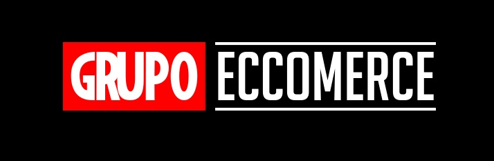

# Grupo 5: [TiendaMarvel][website]

Bienvenido!

Nuestra tienda se enfoca en vender productos de marvel para toda latinoamerica, traer a tu casa el merchandising y todas las novedades sobre tu franquicia favorita a costos accesibles y a la puerta de tu casa! excelsior!

**Contexto**

Trabajamos para una compañia quien recientemente a tenido contacto con marvel estudios, quien busca poder conseguir intermediarios para poder traer todos sus productos de manera accesible y a precios acordes al territorio de la republica Argentina.
La compañia cierra trato con marvel y sale en busca de programadores para poder llevar a cabo una pagina E-commerce para poder asi tener un alcanze mucho mayor y dar una buena cara a la franquicia trayendo una pagina que contenga tanto productos como tambien promocionales de todo lo relacionado a Marvel , incluyendo una interaccion amigable para el usuario y que sea tanto util como E-commerce asi como tambien un sitio para que la persona pueda volver reiteradas veces a visitar la pagina

**A continuacion usted esta por leer archivos secreots confidenciales sobre los integrantes de esta organizacion de superheroes de la programacion, le pedimos cautela y discrecion, esta bajo su propio riesgo**

## Ezequiel Bauer

Nombre:Ezequiel Bauer
Ubicación : Mar del Plata, Buenos Aires, Argentina

A simple vista, soy solo uno más de los millones de residentes de la costa Atlántica, un esposo y trabajador aplicado como cualquier otro. Pero cuando mí equipo me convoca, tengo el poder de transportar cualquier tipo de información a la dimensión en donde lo requieran, los individuos de este planeta me conocen como **THE MODULE**

## Lucía Cámara

Conocida como Roja en el mundo digital y analógico, ya no existe persona viva que recuerde su nombre con el cual fue anotada en su
nacimiento.
Su fama es tal vez asociada a su poder primario ligado a hacer del mundo un lugar más hermoso, creativo y armoníco en cuál vivir, encontrar el límite a este poder y ver que era pura fantasía la llevo a transitar un camino de búsqueda y evolución, y así poder pasar de crear hermosas ilusiones a la vista, pero que eran solo eso, ilusiones, crear un verdadero mundo nuevo, y como este camino no le sería para nada fácil reunió a los mejores compañeros para tremenda misión y así es como evoluciono y paso de ser "La Roja" a **AdobeWitch**

## Cristial Lell

Un joven de Tucumán, nada sobresaliente en su vida junto a los demás jóvenes del lugar. Hasta que los requerimientos de sus amigos desafían la realidad, su sentido programador se activa para demostrar que nada es imposible en la dimensión de los ceros y unos. Lo llaman **Mr. ROBOT**

## Ivan Lezcano

En las oscuras calles de zona sur nace un joven marginado por las sociedad...rechazado por sus compañeros se dedica a aprender musica y magia. 
una oscuras noches de lomas de zamora atrae al joven a la rama profunda y misteriosa de la programacion
Ah adquirido conocimientos a travez de los años gracias a su amigo el "guru" quien lo guia y yendo por los santuarios secretos de sabiduria como **la FF** (Fundacion Formar) 
Atrapado en este bucle de interaciones, rodeado de condicionales, las cadenas del destino hacen que los enteros parezcan flotantes, y los paradigmas falsos....solo hay algo verdadero...y es que desde hoy la gente solo me conoce como....**EL BOOLEANO**!

## Paginas de referencia : 

https://www.marvel.com/
https://www.wizardingworld.com/
https://www.shopdisney.com/marvel-content/#
https://tndt.com.ar/marvel
https://www.ovnipress.net/
https://www.lego.com/es-ar
https://www.dafiti.com.ar/

[website]:https://tienda-marvel-la.netlify.app/
