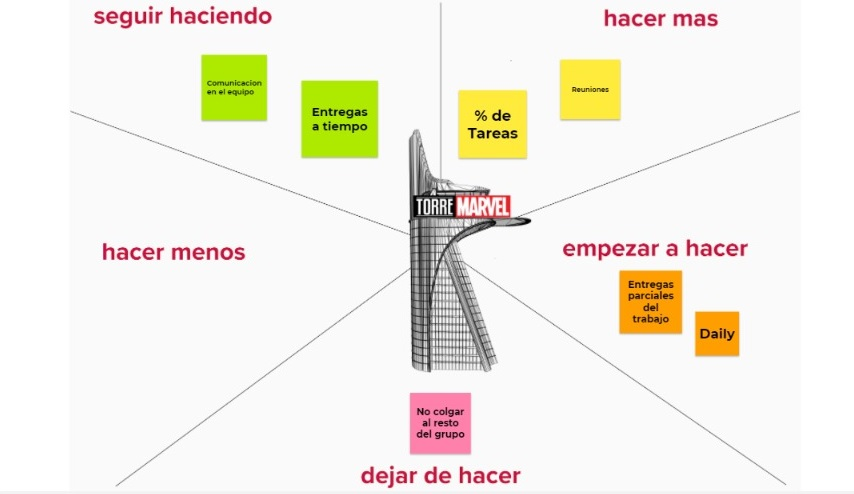

# Grupo 5: [TiendaMarvel][website]

Nuestro trabajo en el primer sprint como equipo fue bastante fluido, a decir verdad no encontramos tareas que deberiamos hacer menos.

decidimos que en nuestro esquema colocar en la parte de **dejar de hacer** cosas como olvidar tareas del grupo era una buena idea asi como tambien **empezar a hacer** reuniones de equipo mucho mas seguido asi como hacer entregas parciales de lo que fuimos avanzando para tener asi un panorama actual de la fase de nuestro proyecto

**Seguimos** reforzando pero manteniendo la comunicacion del equipo asi como tambien las entregas en tiempo y forma como lo fue en el primer sprint como **empezar a hacer** una mejor organizacion de tareas asi como tambien reuniones

esto es todo por ahora lector! espero que disfrute mucho las siguientes etapas! EXCELSIOR!!! 

[website]:https://tienda-marvel-la.netlify.app/
